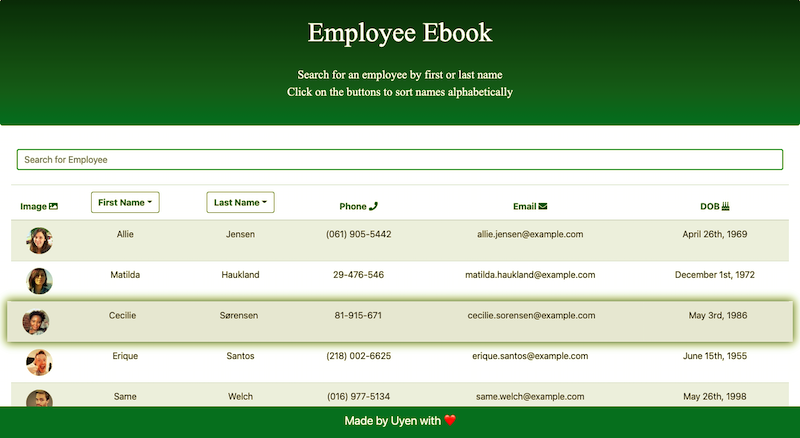

# Unit 20 React Homework: Employee Directory

## Description

Check out the deployed application [here](https://uyennguyen30696.github.io/employee-directory/).

This is a single page web application created with [React](https://reactjs.org/), which allows users to view non-sensitive data from the entire employee directory at once. The application's UI is broken up into reusable components, managed by component state, and responds to user events. The random demo employee data appearing in this application are generated from [randomuser.me API](https://randomuser.me/).

The user is able to:

  * Sort the table first or last name alphabetically

  * Filter the employees by first or last name

### User Story

```
As a user, I want to be able to view my entire employee directory at once so that I have quick access to their information.
```

### Screenshot


